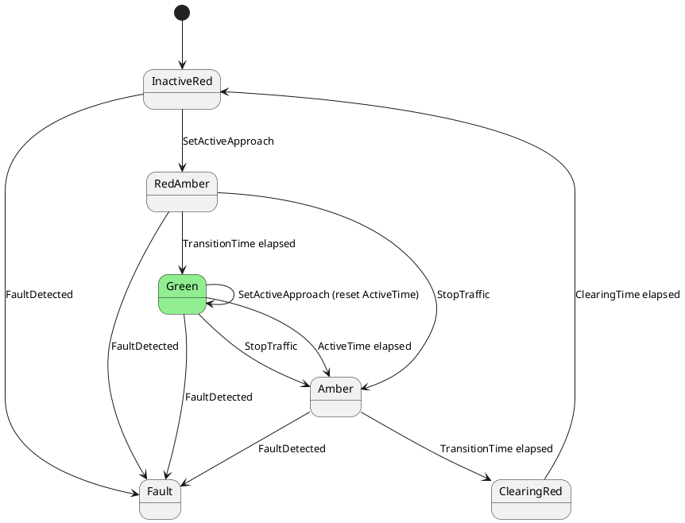

# Traffic Light Simulation — Final Specification

1. This sample simulates an n‑way traffic light controlled area. The user may select how many approaches to simulate and a traffic light will exist for each approach. Each light is modelled as a finite state machine, with one instance per light.

## Definitions

Traffic
: Something, typically a vehicle or person, that wishes to transit a controlled area.
 
Controlled Area
: The area controlled by a set of traffic lights, though which traffic may transit. Typically a section of road or a road interchange, but can also be other areas such as pedestrian walkways, one‑way streets, tunnels, staircases or any area in which the flow of traffic must be controlled.

Traffic Light
: A visual indication to traffic that it may or may not enter a controlled area. A traffic light is an independent modular unit with a fixed phase sequence of colours. When triggered by the approach sequencer, the light becomes an active approach and begins transitioning through its phase sequence, which is modelled as a finite state machine. Upon completion of the sequence, the light signals the approach sequencer that it has completed its cycle and is back at the InactiveRed phase.

Phase
: A distinct state of a traffic light that can be mapped to a colour display. The possible colour configurations are: Red, Red+Amber, Green, Amber.

Approach
: The location where traffic may enter the controlled area by passing a traffic light. There will be a traffic light at each approach.

Active Approach
: Any approach that is currently allowing traffic to transit the controlled area.

Inactive Approach
: An approach that is not allowing traffic to transit the controlled area. An inactive approach shall display a red light.

Approach Sequencer
: A service that monitors the state of each approach and decides which approach(es) are to become active. The application shall be architected to support multiple active approaches; however, the initial sequencer implementation shall allow exactly one active approach at a time using a round‑robin strategy. More sophisticated strategies (e.g., favouring the longest queue or sensor‑driven activation) may be introduced later.

## State Machine Design
### Traffic Light

There shall exist a set of custom states; ITrafficLightState inherits IState, and an abstract class TrafficLightStateBase implements ITrafficLightState. The state machine instance for each light will be created as `FiniteStateMachine<ITrafficLightState>`. Triggering actions are separated into a dedicated interface ITrafficLightActions to follow the Interface Segregation Principle (ISP).

The light exposes the following triggering actions via ITrafficLightActions (states do not implement these):
- SetActiveApproach(ApproachActivationConfig config) in the InactiveRed state starts the phase sequence using config for all phase timings of the activation. When received in the Green state, it replaces the current activation configuration with config and resets the Green phase timer (ActiveTime) from the moment of receipt, allowing the sequencer to extend or reduce the green dwell by issuing additional SetActiveApproach triggers while in Green. It is ignored in all other states.
- FaultDetected — causes immediate transition to a per‑light Fault state (flashing Amber) to indicate a hardware or critical error affecting that approach.
- StopTraffic — triggers an orderly transition from the current phase towards InactiveRed.

StopTraffic behaviour:
- From any state except InactiveRed and ClearingRed, transition immediately to Amber, which will then transition to ClearingRed and then InactiveRed by normal timing.
- In InactiveRed and ClearingRed, StopTraffic has no effect (ignored).
- From Fault, there is no transition; recovery requires a complete system restart.

### Approach Sequencer

The Approach Sequencer must be pluggable. Different sequencing strategies shall be possible simply by substituting a different sequencer implementation. There will be an IApproachSequencer interface and an initial basic implementation SimpleRoundRobinApproachSequencer that allows one active approach and round‑robin scheduling.

Upon start‑up, the sequencer shall await a signal from each approach that it is in the InactiveRed ready state and must receive the signal from every approach before any approach can become active.

Sequencer–light contract:
- The sequencer subscribes to each light’s ObservableStates to detect InactiveRed (completion) and Green (for potential dwell adjustments).
- Initial strategy: strict round‑robin across configured approaches; start from index 0 on system start.
- The sequencer may resend SetActiveApproach(config) while a light is in Green to extend or reduce dwell. It should not send SetActiveApproach in other phases.
- The sequencer shall not select a light in Fault.
- Recovery: Restart stops all FSMs, disposes subscriptions, reconstructs lights and sequencer, and starts from InactiveRed.

## Configuration

### Activation Configuration DTO

The sequencer shall supply an immutable activation snapshot on each activation and any Green re‑arm:

```csharp
public sealed record ApproachActivationConfig(
    string ActivationId,
    DateTimeOffset TimestampUtc,
    TimeSpan ActiveTime,
    TimeSpan TransitionTime,
    TimeSpan ClearingTime
);

public interface ITrafficLightActions
{
    void SetActiveApproach(ApproachActivationConfig config);
    void StopTraffic();
    void FaultDetected();
}

public interface ITrafficLightState : IState { }
```

- The light implements ITrafficLightState (for FSM participation) and ITrafficLightActions (for triggers) via its controller/aggregate, keeping state types focused on state behaviour.

Configuration items and purpose:

| Configuration Item | Purpose                                                                                         | Units  |
| ------------------ | ----------------------------------------------------------------------------------------------- | ------ |
| ClearingTime       | The dwell time after a traffic light returns to red before the next approach can become active. | seconds|
| TransitionTime     | Time to remain at Amber or RedAmber.                                                            | seconds|
| ActiveTime         | The time for the approach to maintain a green light.                                            | seconds|

Application points:
- TransitionTime applies to RedAmber and Amber.
- ActiveTime applies to Green.
- ClearingTime applies to ClearingRed and is included in ApproachActivationConfig.

Configuration for an approach is supplied as an immutable activation snapshot via SetActiveApproach(ApproachActivationConfig config). The light does not persist configuration; the effective timings for a cycle are those in the most recently received config for the current activation. When in Green, receipt of a new SetActiveApproach(config) replaces the current activation configuration and resets the Green timer from the moment of receipt; otherwise, new configuration takes effect on the next activation from InactiveRed. Validation of configuration values is performed by the sequencer.

Validation and defaults:
- ActiveTime default 15.0 s; allowed range 0.5–120.0 s.
- TransitionTime default 2.0 s; allowed range 0.5–10.0 s.
- ClearingTime default 2.0 s; allowed range 0.5–10.0 s.
- The sequencer shall reject configurations outside these ranges.

## Phase Transitions

The phases and their mapping to the colour display are:

| Phase (state name) | Colour Display |
| ------------------ | -------------- |
| InactiveRed        | Red            |
| RedAmber           | Red and Amber  |
| Green              | Green          |
| Amber              | Amber          |
| ClearingRed        | Red            |
| Fault              | flashing Amber at 2 Hz (50% duty) |

When SetActiveApproach(config) is triggered in the InactiveRed state, this starts the light clocking through its phase sequence and sets the current activation configuration to config; when triggered in the Green state it replaces the current activation configuration with config and resets the Green phase timer (ActiveTime) from the moment of receipt. It is ignored in all other phase states. The phase transitions are as defined in the following diagram:



Each state's OnEnter method initialises a phase timer with an appropriate value for that state, taken from the activation configuration. When the phase timer expires, it triggers transition to the next state. The exception to this is the InactiveRed state, which has no timeout and transitions only when triggered by the sequencer. Timers are implemented within each state's RunAsync(CancellationToken) using async delays.

Each traffic light uses a finite state machine to control its transitions based on `TA.Utils.StateMachine.FiniteStateMachine<ITrafficLightState>`. All lights start InactiveRed and must remain so until they are triggered to become the active approach. An ApproachSequencer service will select one of the lights and send it the SetActiveApproach trigger. The light will then cycle through its state machine until it becomes InactiveRed again (after the ClearingRed dwell), after which the sequencer may select another light to become the active approach. Initially, a round‑robin sequencing strategy will be used but this must be extensible so that more advanced strategies can be added later.

The sequencer should implement a timeout period, within which each approach must complete its sequence. If any light does not signal completion within the allowed time, an error condition is declared. Sequencing halts and operator intervention is required; behaviour on timeout does not trigger any automatic state changes in this version.

Faults
- Per‑light faults: FaultDetected transitions that light to Fault (flashing Amber). The sequencer shall not select a light in Fault as an active approach.
- There is no runtime exit from Fault; recovery requires a complete system restart.

## Application Architecture

### General

The application shall be a Windows MAUI cross‑platform app and shall work on Windows as the reference implementation, plus Android, at minimum.

The app shall be developed test‑first using the MSpec BDD specification framework. Where possible, the Establish, Because and It members of each test shall be a single statement. The use of builders (especially in the Establish statement) and context classes should be used where this makes tests smaller and more readable. Time should be abstracted using .NET 8 TimeProvider so unit tests can run without real delays (use a controllable TimeProvider in tests).

The app shall adhere to the SOLID Principles of object oriented design and there shall be a strong preference for clean, readable code over compactness or performance. Robert C. Martin's clean code principles shall be followed where practicable.

### UI Design Pattern

The UI shall use the MVVM pattern and minimise the use of code‑behind in views.

The application shall prefer to use the PropertyChanged.SourceGenerator NuGet package to source‑generate all observable public properties in ViewModels, and optionally other model classes.

### Composition Root and Dependency Injection

The app shall use Dependency Injection via the Ninject library and shall have a static CompositionRoot class that owns and configures the DI kernel and provides a method `TService Get<TService>()` that encapsulates the DI framework. Where possible, all object creation and lifetime management shall be delegated to the Dependency Injection framework. Where possible, objects should receive their dependencies via constructor injection.

### UI/UX for the sample
- Controls: Start, Stop, Reset; number of approaches selector (editable only while sequencing is stopped); editable ActiveTime, TransitionTime, ClearingTime per approach.
- Visuals: For each approach, render a traffic light with Red, Red+Amber, Green, Amber states and a flashing Amber for Fault.
- Telemetry/logging: Show current state name and time remaining in the current state for each approach; show recent transitions. Telemetry values shall use a fixed field width and always include a signed value as per house style.

Simulation model and telemetry
- Queue length per approach: Maintain and display a live queue length for each approach; update on each simulated arrival and departure event.
- Traffic arrivals (per approach): Simulate arrivals using a stochastic process parameterised by the configured mean inter‑arrival time (seconds). UI range 1–300 s, resolution 1 s. Recommended distribution: exponential with mean equal to the configured value. Changes in the UI take effect immediately.
- Traffic departures (active approach only): Simulate departures at a configurable interval (seconds between departures). UI range 1.0–10.0 s, resolution 0.1 s. Departures are eligible while the approach is in Green and during the first half of the Amber phase (i.e., for TransitionTime/2 after entering Amber). No departures occur during RedAmber, ClearingRed, or InactiveRed. Changes in the UI take effect immediately.
- Immediate effect of UI controls: All changes to simulation controls (arrival mean, departure interval, number of approaches, timings) shall immediately affect simulation behaviour; use .NET 8 TimeProvider to ensure deterministic, testable timing.
- Queue length graph: Display a chart of queue length over time across all approaches. The chart shall be full window width and appear at the top of the window. Represent each approach as a distinct coloured line; update in real time with efficient sampling to avoid UI jank.
- Time remaining display: For the current state, compute time remaining based on the state’s scheduled expiry using TimeProvider and the active ApproachActivationConfig. Ensure the display updates at least 10 Hz for smoothness without excessive CPU usage.
- Fault state rendering: In Fault, display a flashing Amber lamp at 2 Hz (50% duty); queue length updates continue to be displayed; arrivals should continue to be simulated, but departures do not occur while not active.
- Accessibility: The state name is displayed and is unambiguous; no separate colour labels are required. Ensure sufficient contrast for the chart and lamp visuals.

Control semantics
- Start (IRelayCommand): Starts the arrival and departure simulations, starts the sequencer, then starts each approach’s state machine after a random start‑up delay of up to 10 seconds per approach (using TimeProvider). The Start button binds to an IRelayCommand and is disabled while its action executes. The sequencer shall not begin selecting an active approach until it has observed every approach enter InactiveRed (i.e., it has seen each FSM start and reach ready state).
- Stop (IRelayCommand): Causes the sequencer to send StopTraffic to all approaches, then wait until every approach has entered InactiveRed. Once the sequencer has fully stopped, the arrival and departure simulations shall also stop. The Stop button binds to an IRelayCommand and is disabled while its action executes.
- Reset (IRelayCommand): Restarts the sequencer and all approaches to recover from a fault state (equivalent to stop, re‑initialise, and start as above). The Reset button binds to an IRelayCommand and is disabled while its action executes. Fault detection is not yet modelled and will be introduced in a future iteration.
- Number of approaches: This value may be changed only while the sequencer is stopped. The UI shall disable or reject changes to this control while the system is operational. After a change, on the next Start, approaches are (re)created and the round‑robin sequencer restarts from index 0.
