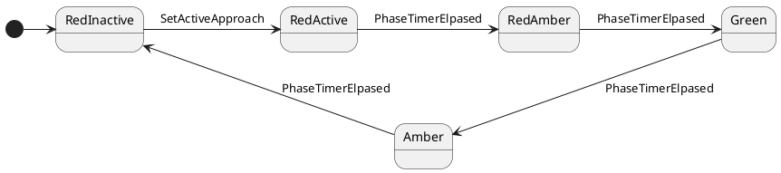

This sample simulates an n-way traffic light controlled road segment or intersection. The user may select how many "approaches" to simulate and a traffic light will exist for each approach. Each light will be modelled as a finite state machine, there will be one instance of the state machine for each light.

## Definitions

Traffic
 : Something, typically a vehicle or person, that wishes to transit a _controlled area_.
 
Controlled Area
 : The area controlled by a set of traffic lights, though which traffic may transit. Typically a section of road or a road interchange, but can also be other areas such as pedestrian walkways, one-way streets, tunnels, staircases or any area in which the flow of traffic must be controlled.

Traffic Light
 : A visual indication to _traffic_ that it may or may not enter a _controlled area_. A traffic light is an independent modular unit with a fixed phase sequence of colours. When triggered by the _approach sequencer_, the light becomes an _active approach_ and begins transitioning through its phase sequence, which will be modelled as a finite state machine. Upon completion of the sequence, the light signals the _approach sequencer_ that it has completed it's cycle and is back at the Red phase.

Phase
 : A distinct state of a _traffic light_ that can be mapped to a colour display. Each phase may map to one or more colours. The possible colour configurations are: Red, Red+Amber, Green, Amber. 

Approach
 : The location where traffic may enter the _controlled area_ by passing a _traffic light_. There will be a _traffic light_ at each approach.

Active Approach
 : The approach that is currently allowing _traffic_ to transit the _controlled area_. At any given moment, there may be zero or one active approaches.

Approach Sequencer
 : A service that monitors the state of each approach and decides which approach(es) are to become active. The sequencer may use a number of strategies for sequencing the approaches. The simple case is a single active approach with a round-robin scheduler. More sophisticated sequencing strategies may make use of sensor inputs to detect waiting traffic, traffic moving within the controlled area and it may be able to support multiple active approaches. 
### State Machine Design
#### Traffic Light

There shall exist a set of custom states, `ITrafficLightState` inherits `IState`, and an abstract class `TrafficLightStateBase` implements `ITrafficLightState`. The state machine instance for each light will be created as `FiniteStateMachine<ITrafficLightState>`.

`ITrafficLightState` shall define the following trigger methods: 
- `SetActiveApproach` action in the `InactiveRed` state to trigger the phase sequence.
- `FaultDetected`- causes immediate transition to a fault state which displays a flashing Amber light.
- `StopTraffic` - triggers an orderly transition to the `Amber` state and ultimatelt the `InactiveRed` state, so that all traffic is stopped.

#### Approach Sequencer

[ToDo]

### Configuration

[ToDo]

## Phase Transitions

 The phases and their mapping to the colour display are:

| Phase (state name) | Colour Display                        |
| ------------------ | ------------------------------------- |
| InactiveRed        | Red                                   |
| ActiveRed          | Red                                   |
| RedAmber           | Red and Amber                         |
| Green              | Green                                 |
| Amber              | Amber                                 |
| Fault              | flashing Red with a period of 2 Hz.   |
| Caution            | flashing Amber with a period of 2 Hz. |

When `SetActiveApproach` is triggered in the `RedInactive` state, this starts the light clocking through it's phase sequence. It is ignored in all other phase states. The phase transitions are as defined in the following diagram:

Each state's `OnEnter` method initializes a phase timer with an appropriate value for that state, which is taken from.

Each traffic light uses a finite state machine to control it's transitions. All lights start Red and must remain red until they are triggered to become the _active approach_. An `ApproachSequencer` service will select one of the lights and send it the "SetActiveApproach" trigger. The light will then cycle through its state machine until it becomes Red again, and signals the `ApproachSequencer` that it has completed its cycle. The sequencer is then free to select another light to become the active approach. Initially, a round-robin sequencing strategy will be used but this must be extensible (possibly using the Strategy pattern) so that more advanced strategies can be added later (for example, a `FavourLongestQueueStrategy` could select the light with most traffic waiting at it).

The sequencer should implement a timeout period, within which each approach must complete its sequence. If any light does not signal completion within the allowed time, an error condition is declared and all lights will be sent