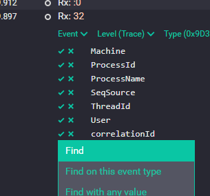

# Timtek Commonly Used Helpers and Utilities

This library represents a collection of classes factored out of our production projects, that we found were being used over and over again.
Rather than re-using the code at source level, it is now collected together in this package as a general purpose reusable library and made freely available for you to use at no cost and with no obligation. The only stipulation is that you can't sue the author or Timtek Systems Limited
if anything bad happens as a result of you using the code. It's up to you to determine suitability for your purpose.

<!-- @import "[TOC]" {cmd="toc" depthFrom=1 depthTo=6 orderedList=false} -->

<!-- code_chunk_output -->

- [Timtek Commonly Used Helpers and Utilities](#timtek-commonly-used-helpers-and-utilities)
  - [Software Re-use at the Object Code level](#software-re-use-at-the-object-code-level)
  - [Licensing](#licensing)
  - [Description of Classes](#description-of-classes)
    - [Versioning](#versioning)
      - [`SemanticVersion` class](#semanticversion-class)
      - [GitVersion Support](#gitversion-support)
    - [Readability and Intention-revealing Code](#readability-and-intention-revealing-code)
      - [Maybe?](#maybe)
    - [Bit Manipulation](#bit-manipulation)
      - [Octet](#octet)
    - [Diagnostics](#diagnostics)
      - [`ConsoleLoggerService` implements `ILog`](#consoleloggerservice-implements-ilog)
      - [ASCII Mnemonic Expansion](#ascii-mnemonic-expansion)
      - [Display Equivalence for Enumerated Types](#display-equivalence-for-enumerated-types)
    - [Asynchrony and Threading](#asynchrony-and-threading)
      - [ConfigureAwait](#configureawait)
      - [Cancel Culture](#cancel-culture)
      - [Logging](#logging)
    - [Two-stage Approach to Logging](#two-stage-approach-to-logging)
    - [A Note on Semantic Logging](#a-note-on-semantic-logging)
    - [Seq Special Considerations](#seq-special-considerations)
      - [TL;DR](#tldr)
      - [Log Correlation](#log-correlation)
      - [Custom Severity Levels](#custom-severity-levels)
  - [Release Notes](#release-notes)

<!-- /code_chunk_output -->


## Software Re-use at the Object Code level

This was always the promise of _Object Oriented Design_, but it was not until the advent of [NuGet][nuget] and its widespread adoption that this became a practical reality.
It is easy to overlook the impact of [NuGet][nuget], as it seems so obvious and natural once you've used it.

> "Dependency management is the key challenge in software at every scale." 
> Possibly attributed to **Donald Knuth**, _The Art of Computer Programming_

NuGet has essentially solved a large chunk of the dependency management problem.
At Timtek Systems, we use NuGet as a key component in our software design strategy.
We publish our open source code on a [public MyGet feed][myget].
We push both prerelease and release versions to [MyGet][myget].
When we make an official release, we promote that package from [MyGet][myget] to [NuGet][nuget].
You can consume our packages from either location, but if you want betas and release candidates, then you'll need to use [our MyGet feed][myget].

## Licensing

This software is released under the [Tigra MIT License][mit], which (in summary) means:
"Anyone can do anything at all with this software without limitation, but it's not our fault if anything goes wrong".

Our [philosophy of open source][yt-oss] is to [give wholeheartedly with no strings attached][yt-oss].
We have no time for "copyleft" licenses which we find irksome.

So here it is, for you to use however you like, no strings attached.

I tend to use "we" and "our" when talking about the company, but Timtek Systems Limited is a one-man operation run by me, Tim Long.
I hope you find the software useful, and if you feel that my efforts are worth supporting, then it would make my day if you would [buying me some coffee][coffee].
I also wouldn't mind you giving us a mention, if you feel you are able to, as it helps the company grow. Donations and mentions really make a difference, so please think about it and do what you can.

If you are a company and need some work done, then consider hiring me as a freelance developer. I have decades of experience in product design, firmware development for embedded systems and PC driver and software development. I'm a professional; I believe in doing what's right, not what's expedient and I support my software.

## Description of Classes

### Versioning

Timtek has settled on a versioning strategy based on [Semantic Versioning 2.0.0][semver].

We give all of our software a semantic version, which we display to the user in the About box and write out to log files on startup.
We use [GitVersion][gitversion] to [automatically assign a version number to every build][yt-gitversion] (even in [Arduino projects][yt-gitversion-arduino]).
We never manually set the version number, it happens as part of the build process.
So we can never forget to "bump the version" and we can never forget to set it.
Total automation.
If you examine one of our log files, you may well find something like this:

```log
21:16:59.2909|INFO |Server          |Git Commit ID: "229c1acc4a7bda494f78a8c7cc811c2a4d8e9132"
21:16:59.3069|INFO |Server          |Git Short ID: "229c1ac"
21:16:59.3069|INFO |Server          |Commit Date: "2020-07-11"
21:16:59.3069|INFO |Server          |Semantic version: "0.1.0-alpha.1"
21:16:59.3069|INFO |Server          |Full Semantic version: "0.1.0-alpha.1"
21:16:59.3069|INFO |Server          |Build metadata: "Branch.develop.Sha.229c1acc4a7bda494f78a8c7cc811c2a4d8e9132"
21:16:59.3069|INFO |Server          |Informational Version: "0.1.0-alpha.1+Branch.develop.Sha.229c1acc4a7bda494f78a8c7cc811c2a4d8e9132"
```

There's no mistaking where that build came from.

#### `SemanticVersion` class

Since we rely heavily on semantic versioning, it is useful to have a class that encapsulates all the rules for parsing, outputting, comparing and sorting semantic versions. That is the function of the `SemanticVersion` class. With it you can:

- Parse a semantic version string;
- Validate a semantic version string;
- Format a version for display, logging or printing;
- Test the equality of two versions using the correct comparison rules;
- Sort versions using the correct collation rules.

#### GitVersion Support

[GitVersion][gitversion] also injects a static class into the assembly containing all the versioning information it computed based on your Git commit history.
This information can be a little tricky to get at, because it doesn't exist at compile time so you can't easily reference it. You have to use Reflection to get at it.
Our `GitVersion` class contains static properties for getting your semantic version metadata at runtime. We use it to write the log entries as shown above.

### Readability and Intention-revealing Code

#### Maybe?

One of the most insideous bug producers in .NET code is the null value.
Do you return `null` to mean "no value"?
What's the caller supposed to do with that?
Did you mean there was an error?
Did you mean there wans't an error but you can't give an answer?
Did you mean the answer was empty?
Or did someone just forget to initialize the variable?

I'm not a fan of Microsoft's solution to the Null Reference problem.
I think their _Nullable Reference Types_ [sic] are clumsy and make the code look ugly.
They couldn't even get the name right - reference types were *always* nullable!

The ambiguity around "error" vs. "no value" is why we created `Maybe<T>`.

`Maybe<T>` is a type that either has a value, or doesn't, but it is never null.
The idea is that by using a `Maybe<T>` you clearly communicate your intentions to the caller.
By returning `Maybe<T>` you nail down the ambiguity:
"there might not be a value and you have to check".

Strictly, a `Maybe<T>` is an `IEnumerable<T>` which is either empty (no value) or has exactly one element.
Because it is `IEnumerable` you can use certain LINQ operators:

- `maybe.Any()` will be true if there is a value.
- `maybe.Single()` gets you the value.
- `maybe.SingleOrDefault()` gets you the value or `null`.

Creating a maybe can be done by:

- `object.AsMaybe();` - wrap a non-null object.
- `Maybe<int>.From(7);` - works with value types, and also safe for null references.
- `Maybe<T>.Empty` - a maybe without a value.

`Maybe<T>` has a `ToString()` method so you can write it to a stream or use in a string interpolation, and you will get the serialized value or "`{no value}`".

Try returning a `Maybe<T>` whenever you have a situation wehere there may be no value, instead of `null`.
You may find that your bug count tends to diminish.

### Bit Manipulation

#### Octet

An `Octet` is an immutable type that represents 8 bits, or a byte.
In most cases, it can be directly used in place of a `byte` as there are implicit conversions to and from a `byte`.
There are also explicit conversions to and from `int`.
The latter is explicit because there is potentially data loss, so use with care.

Note that conversion from `uint` has been deprecated because `uint` is not CLS Compliant, which can cause issues with other languages.

In an `Octet`, each bit position is directly addressable as an array element.
You can access `octet[0]` through `octet[7]`.

You can set a bit with `octet.WithBitSet(n)`.
You can clear a bit with `octet.WithBitClear(n)`.

Remember `Octet` is _immutable_ so this gives you a new `Octet` and leaves the original unchanged.

You can perform logical bitwise operations using the `&` anf `|` operators.
You can test octets for equality and compare them using `==`, `!=`, `>`, `<`, etc.

### Diagnostics

#### `ConsoleLoggerService` implements `ILog`

One step up from the `DegenerateLoggerService`, enables easy rudimentatary logging to the console
without depending on any logging framework or configurations files. This is meant to be a light-weight
stop-gap logging solution for projects that never get large enough to warrant full structured logging.

`ConsoleLoggerService` is fully compatible with and interchangeable with any logging back-end built on the `ILog` interface.
The _Liskov Subsitution Principle_ is observed, so it remains easy to switch logging back-ends just by changing a binding in your
IOC container. Start yoru console app with a `ConsoleLoggingService`, then when it becomes a limitation, simply plug-in a full-blown
logger such as the NLog implementation founf in `TA.Utils.Logging.NLog`.

#### ASCII Mnemonic Expansion

When dealing with streams of ASCII-encoded data, it is often helpful to be able to see non-printing and white space characters.
This is especially useful when logging.
The `ExpandAscii()` extension method makes this simple.
Us `string.ExpansAscii()` and cahacters such as carriage return, for example, will be rendered as `<CR>` instead of causing an ugly line break in your log output.

`ExpandAscii()` uses the mnemonics defined in the `AsciiSymbols` enumerated type.

#### Display Equivalence for Enumerated Types

The `[DisplayEquivalent("text")]` Attribute works with the `EnumExtensions.DisplayEquivalent()` extension method.
This can be useful for building drop-down lists and Combo box contents for enumerated types.
You can always get the equivalent human-readable display text for an enumerated value using `value.DisplayEquivalent()`.
This will return the display text if it has been set, or the name of the enum value otherwise.
Set the display text by dropping a `[DisplayEquivalent("text")]` attribute on each field of the enum.

```csharp
    [Subject(typeof(DisplayEquivalentAttribute))]
    internal class when_displaying_an_enum_with_equivalent_text
        {
        It should_have_equivalent_text_when_the_attribute_is_present = () =>
            TestCases.CaseWithEquivalentText.DisplayEquivalent().ShouldEqual("Equivalent Text");
        It should_use_the_field_name_when_no_attribute_is_present = () =>
            TestCases.CaseWithoutEquivalentText.DisplayEquivalent()
                .ShouldEqual(nameof(TestCases.CaseWithoutEquivalentText));
        }

    internal enum TestCases
        {
        [DisplayEquivalent("Equivalent Text")] CaseWithEquivalentText,
        CaseWithoutEquivalentText
        }
```

### Asynchrony and Threading

#### ConfigureAwait

There is an extension method in .NET used to configure awaitable tasks, called `ConfigureAwait(bool)`.
The method affects how the task awaiter schedules its continuation.
With `ConfigureAwait(true)` the task continues on the current synchronization context.
That usually means on the same thread, and is particularly relevant when the awaiter is a user interface thread.
Conversely, `ConfigureAwait(false)` means that continuation can happen on any thread, 
and typically that will be a thread pool worker thread.
The implications are quite profound, especially for apartment-threaded GUI applications such as WinForms or WPF. 
Consider the following method:

```csharp
public async Task SomeMethod()
    {
	Console.WriteLine("Starting on thread {0}", Thread.CurrentThread.ManagedThreadId);
	await Task.Delay(1000).ConfigureAwait(false);
	Console.WriteLine("Continuing on thread {0}", Thread.CurrentThread.ManagedThreadId);
    }
```

When you run this, you may get something like

> Starting on thread 14  
> Continuing on thread 11

But it is not at all ovious how `ConfigureAwait()` should be used.
What if you don't specifiy?
Is the await configured or unconfigured?
Does `ConfigureAwait(false)` mean you don't want to configure it, or that you want to configure it not to do something?
It's just horrible.
You can't read the code and instantly understand what it does, and that violates the _Principle of Least Astonishment_.

So we made some extension methods that essentially do the same thing, but make more sense. Our aync method now becomes:

```csharp
public async Task SomeMethod()
    {
	Console.WriteLine("Starting on thread {0}", Thread.CurrentThread.ManagedThreadId);
	await Task.Delay(1000).ContinueOnAnyThread();
	Console.WriteLine("Continuing on thread {0}", Thread.CurrentThread.ManagedThreadId);
    }
```

and we get

> Starting on thread 15  
> Continuing on thread 13

Alternatively:

```csharp
public async Task SomeMethod()
    {
	Console.WriteLine("Starting on thread {0}", Thread.CurrentThread.ManagedThreadId);
	await Task.Delay(1000).ContinueInCurrentContext();
	Console.WriteLine("Continuing on thread {0}", Thread.CurrentThread.ManagedThreadId);
    }
```

The await captures the current `SynchronizationContext` and uses it to schedule the continuation.
What happens next depends on the application model and how it implements `SynchronizationContext`.
For a user interface application, the UI generally runs in a Single Threaded Apartment (STA thread).
In this model, asynchronous operations are posted to the message queue of the STA thread.
The continuation will then happen on the UI thread once the thread is idle and the message pump runs.
In a free-threaded application model such as a console application, the continuation will likely
still happen on a different thread.

Here you can see the danger of this option.
If the continuation is queued in the message queue waiting for messages to be pumped, but the UI is blocked waiting for the task to complete, then the continuation may never get to run.
The task is prevented from completing and we are in deadlock.
Therefore, best practice for library writers is to always use `ContinueOnAnyThread()`.

#### Cancel Culture

One final extension method is `Task.WithCancellation(token)`.
This takes a task that is not cancellable and wraps it in a cancellable task.
Awaiters can then wait on the cancellable wrapper and will get to run if the wrapper is cancelled.
Note that this doesn't stop the original task from running and it may still run to completion,
but its result will be discarded as there should be nothing awaiting the result.

#### Logging

Logging is a big deal. It is an essential part of debugging during development,
but can also be really useful or even essential in production.
It needs to be easy to use, or developer's won't use it.
It needs to not re-invent any wheels. There are plenty of good logging services out there.

Our approach to logging is this:
1. No dependency on any particular logging framework.
   We define an abstract interface that can be adapted to any back-end logging engine.
2. Follow the KISS principle: "Keep it simple, stupid".
   Logging should be easy enough that people will use it, but have enough flexibility to be useful in the real world.

We provide an abstract fluent builder pattern for easily constructing log entries and which provides an extensibility point
for creating extension methods.

Our fluent builder interface supports _semantic logging_ which enables the creation of rich logging data.

Item (1) notwithstanding, we have based our fluent builder API loosely on the one used by NLog.
We think it is the best balance of simplicity and flexibility. However, we do not depend on NLog
and have made our own abstract interfaces that can target any logging framework.

The `TA.Utils.Core.Diagnostics` namespace defines a pair of interfaces, `ILog` and `IFluentLogBuilder`,
that define an abstract logging service which does not depend on any particular back-end.

Libraries can perform logging through these interfaces without ever taking a dependency on any logging imnplementation.
The actual implementation can be injected at runtime, typically in a constructor parameter.
The policy decision about which logging engine to use can be taken in the top level composition root of the application.

The fluent interface defined in `IFluentLogBuilder` was modeled on the NLog fluent interface, so it is a very natural fit.
However, the interface has enough flexibility to adapt to other logging backends without too much trouble.]

A null implementation is provided in `DegenerateLoggerService` and `DegenerateLogBuilder`.
The two classes do essentially nothing and produce no output; they are a data sink.
Libraries can choose to use this as their default logging implementation, which is easier than checking
whether the logger is null every time it is used.

```csharp
public class MyClassThatUsesLogging
{
    private ILog Log;

    // Construct an instance and optionally inject the logging service implementation.
    public MyClassThatUsesLogging(ILog logService = null)
    {
        // Use the supplied logging service, or fall back to the degenerate logger.
        this.Log = logService ?? new DegenerateLoggerService();
    }

    public void MethodThatGeneratesLogEntries()
    {
        Log.Info()
            .Message("I am loosely coupled. I do not depend on any logging back-end.")
            .Write();
    }
}
```

The interface supports semantic logging. You can use a simple format string like so:

```csharp
log.Info().Message("Sending data {0}", data).Write();
log.Error().Message("Exception {0} occurred with error code {1}", ex.Message, errorCode).Write();
```

But this leaves useful information on the table. Extra rich information can be included like so:

```csharp
log.Info().Message("Sending data {data}", data).Write();
log.Error()
    .Message("Exception {exception} occurred with error code {error}")
    .Property("exception", ex.Message)
    .Property("error", errorCode)
    .Exception(ex)
    .Write();
```

In both statements, we are adding property-value pairs to the log.
In the first `Log.Info()` statement this is implicit, whereas in the `Log.Error()` statement it is made explicit.
This extra information may or may not be used by the log renderer, but if its not there then it can't be used!
So if in doubt, include extra information where it is appropriate.

Again, this feature set is native to NLog so makes for a very lightweight adaptor.
When developing adaptors for other logging frameworks, every attempt shouldbe made to preserve as much of the information as possible.

### Two-stage Approach to Logging

Think of logging as occurring in two distinct stages.

1. You build the log entry using `IFluentLogBuilder`, adding all of the relevant information as _Properties_ of the log entry.
2. You send the log entry to the back-end to be rendered on one or more _Targets_.

Each target may use none, some or all of the information you provided and it may even augment it with additional metadata.
As a library developer, you shouldn't be concerned with how the entry will be rendered, stored or how it will be formatted.
You should concentrate only on including as much relevant information as is appropriate in your log entries.

Multiple targets may be in use and different targets will produce different output from the exact same log entry.
For example:

- A file target may include a timestamp and perform log file rotation so that a new file is created each day.
- A debug output stream may include the name of the class where the log entry originated and print only the message portion.
- A console logger may write different lines in different colours accoring to the severity level.
- A syslog target may include the host name of the originating computer.
- A NoSQL database renderer may write out all of the properties as a JSON document.

In most cases, the way in which log data is ultimately rendered is outside of application control.
Typically, a configuration file is used. The configuration file may be added or changed post-deployment.
As a library developer, you must accept that you have little to no control over this.
Just concentrate on including appropriate and useful information and don't think about formatting or storage.

### A Note on Semantic Logging

If you have always thought about logging as `Console.WriteLine()` statements, then you have probably focussed
on formatting your output and given little thought to the content.
You might struggle to see the point of semantic logging and you might be due for a paradigm shift.
Forget about how your log output _looks_ and focus on what data it _contains_.
Your responsibility as the log entry creator is to include as much relevant data as possible.
Assume that formatting (rendering) and filtering will be done elsewhere and is outside your control.

How useful would it be, for example, if when you logged an exception,
it included all the exception metadata, any inner exceptions, and a full stack trace?
You might struggle to achieve this using `Console.WriteLine()`.
In our paradigm, that is as simple as adding `.Exception(ex)` to your log builder statement.

Having done that, you might think "so what?". The log file produced still only shows the exception message,
so what was the point? We struggled with this oursleves. You put the data in, but it doesn't easily come out
in a meaningful way.
Then one day we were "red-pilled" by [Seq][seq].
We discovered the truth that flat files are an inadequate solution for rendering log output.

We had our "Aha!" moment the first time we logged and exception to Seq and were able to view the full stack trace.
There is so much more to Seq, but that was the moment we understood semantic logging.
Seq unlocks the full usefulness of all that data and will change the way you write log entries.
Once you see the truth, Neo, you cannot go back. You cannot "unsee" Seq.
We realised that merely by changing a configuration file, i.e. with zero code impact,
we could send our log entries across the network to a log server that could store them in a SQL database.
We could then use our web browser to log into that server to view the log data, in real time,
and be able to view, search, filter and query based on the full data that we put into our log entries.

Seq can be used with our logging abstraction and the NLog adapter, and using the NLog.Targets.Seq NuGet package.
You can then configure a Seq target for NLog in your NLog.config file (there is no special code needed).

### Seq Special Considerations

We highly recommend Seq. It's free for a single user and can be set up in a few moments using Docker. This section contains some of our explorations with Seq.

#### TL;DR

- Add and ambient property called `CorrelationId` to all log entries and set it to a new `Guid` each time the program starts. This helps you find all the log entries relating to a particular run of the program.
- Register a _Last Chance Exception Handler_ as soon as your program starts; this will let you catch and log any program crashes as they happen. Have your handler log the exception and display a message to the user with the `CorrelationId` that they should use in any bug reports. This will make it trivial to find the error in the logs.
- When reporting a `CorrelationId` to the user, you can use just the last few digits (we use 6) of the `CorrelationId`, this is usually enough to uniquely identify a log session.
- Use _dependency injection_ and have your IOC container create loggers for injection into class constructors.

 This method may be useful. It was written for use with Ninject, but you can distill out the approach  of looking at the stack frame to work out the calling type and set the logger name from that.

 ```csharp
/// <summary>
///     Get an instance of a service from the dependency injection kernel.
///     Special handling for logging services.
/// </summary>
/// <typeparam name="TService">The type of service requested.</typeparam>
/// <returns>An instance of the requested service.</returns>
public static TService Get<TService>()
{
    if (typeof(ILog).IsAssignableFrom(typeof(TService)))
    {
        // Special handling for request for ILog.
        // Try to determine the calling type by examining the stack, and pass it to the kernel as a binding parameter.
        var callerStackFrame = new StackFrame(1);
        var callingMethod = callerStackFrame.GetMethod();
        // MethodBase.ReflectedType is more reliable than the direct Type property and less likely to return an "un-utterable name".
        var callerType = callingMethod.ReflectedType;
        var callerTypeName = callerType?.Name ?? string.Empty;
        if (!string.IsNullOrEmpty(callerTypeName))
        {
            var logServiceNameParameter = new Parameter(LogSourceParameterName, callerTypeName, false);
            return Kernel.Get<TService>(logServiceNameParameter);
        }
    }

    // For all other requests, simply request the type from the DI kernel.
    return Kernel.Get<TService>();
}
 ```

#### Log Correlation

We use a global static readonly GUID called something like `CorrelationId`.
We initialize this with a new `Guid` as early as possible in the program execution, usually in a static initializer, so that it has a new value for each run of the program. We then add this to every instance of `ILog` as an Ambient Property.

This way, every log entry we write contains a `CorrelationId` value which is unique for each run of the program. In Seq, you can Expand a log entry, find the `CorrelationId` property, and click the checkmark next to it, then select "Find". This will find all the log entries for one run of the program.



#### Custom Severity Levels

NLog has fice severity levels: `Trace`, `Debug`, `Info`, `Warning`, `Error` and a pseudo-level `Fatal` which actually causes the program to exit, so can't really be used as a normal severity level.

We find this a bit limiting and would like to be able to create our own levels, such as `Note` and `Important`.

The `NLog.Targets.Seq` logging target has support for this, and we also support it in our `ILog` interface via the `ILog.Level(string levelName)` method.

The way this works is to create an additional log event property, by default named "CustomLevel", containing the level name. The Seq target then uses this property as the level when it posts the data to the Seq server. If the default property name is no good for some reason, it can be changed using a `LogServiceOptions` instance and setting `LogServiceOptions.CustomSeverityPropertyName` property to the preferred name, like so:

```csharp
var options = LogServiceOptions.DefaultOptions.CustomSeverityPropertyName("SeqLevel");
var log = new LoggingService(options);
```

A small bit of configuration is needed to wire this up, in the Seq target in the `NLog.config` file, like so:

```xml
      <target xsi:type="Seq" name="seq" 
      serverUrl="http://your-server-url:5341"
      apiKey="your-seq-api-key"
      seqLevel="${event-properties:CustomLevel:whenEmpty=${level}}">
```

The magic is in `seqLevel="${event-properties:CustomLevel:whenEmpty=${level}}`

This uses the value of `CustomLevel` as the Seq level, unless it is empty or missing, in which case it defaults to the NLog level.

In targets other than Seq, this will just appear as yet another log event property.

## Release Notes

2.8.1
 : Fixed an issue that caused a custom severity property name option to be ignored. 

2.8.0
: Fixed a formatting bug in `Octet.ToString()`

2.7.0
: Added support for custom severity levels in the `ILog` abstraction and NLog implementation.
: Used the "official" regular expression to validate semantic version strings. Note: some strings that were previously accepted, such as "01.02.03" will no longer be accepted as valid.

[seq]: https://datalust.co/seq "Seq semantic logging service"
[mit]: https://tigra.mit-license.org "Tigra MIT License"
[semver]: https://semver.org/ "the rules of semantic versioning"
[gitversion]: https://gitversion.net/docs/ "GitVersion documentation"
[nuget]: https://www.nuget.org/ "NuGet gallery"
[myget]: https://www.myget.org/feed/Packages/tigra-astronomy "Tigra Astronomy public package feed"
[yt-gitversion]: https://www.youtube.com/watch?v=8WKDk8yPMUA "Automatically versioning your code based on Git commit history"
[yt-gitversion-arduino]: https://www.youtube.com/watch?v=P4B6PTP6aAk "Automatic version in Arduino code with GitVersion"
[yt-oss]: https://www.youtube.com/watch?v=kloweL2fw7Q "Set your software free"
[coffee]: https://www.paypal.com/cgi-bin/webscr?cmd=_s-xclick&hosted_button_id=ARU8ANQKU2SN2&source=url "Support our open source projects with a donation"
